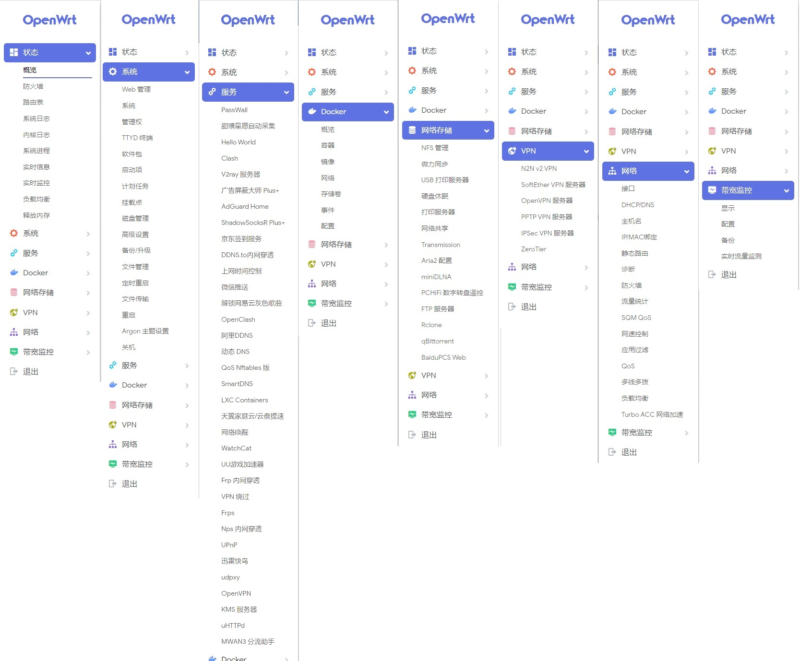
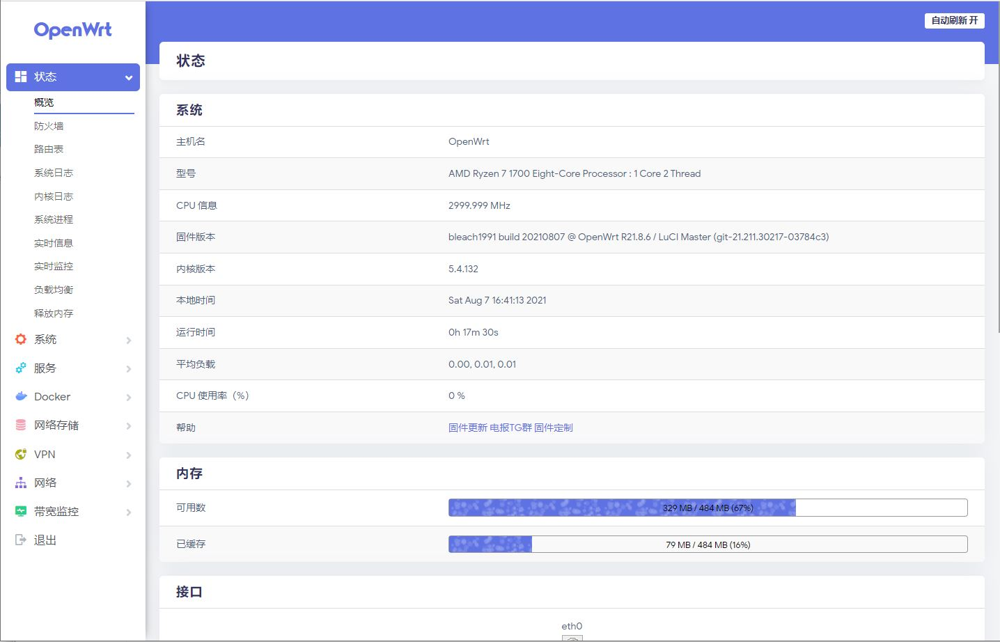
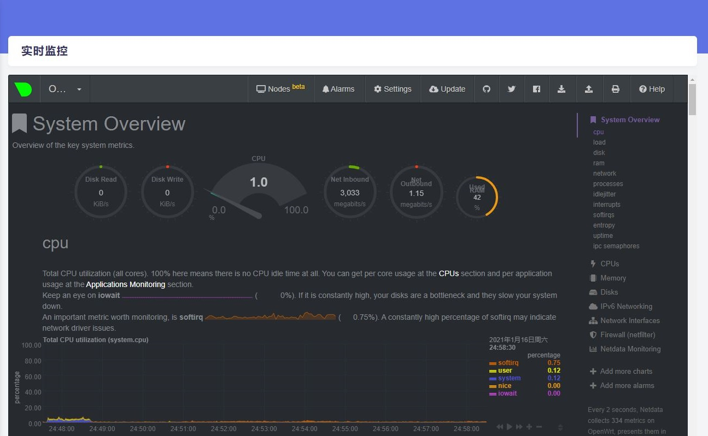
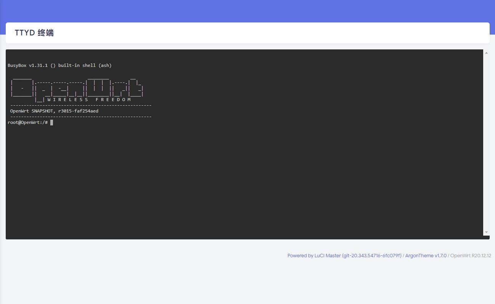
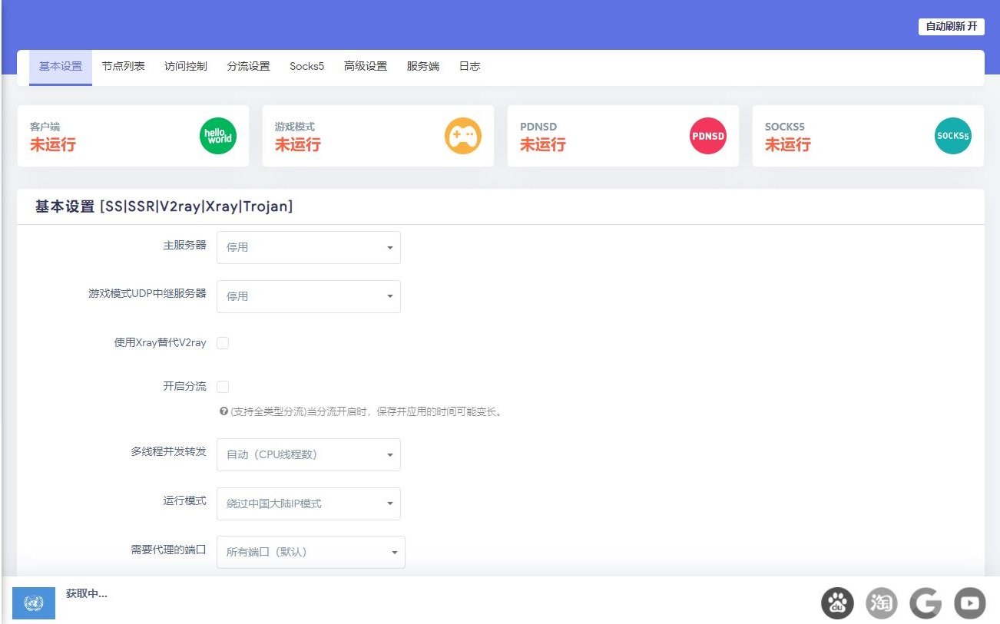
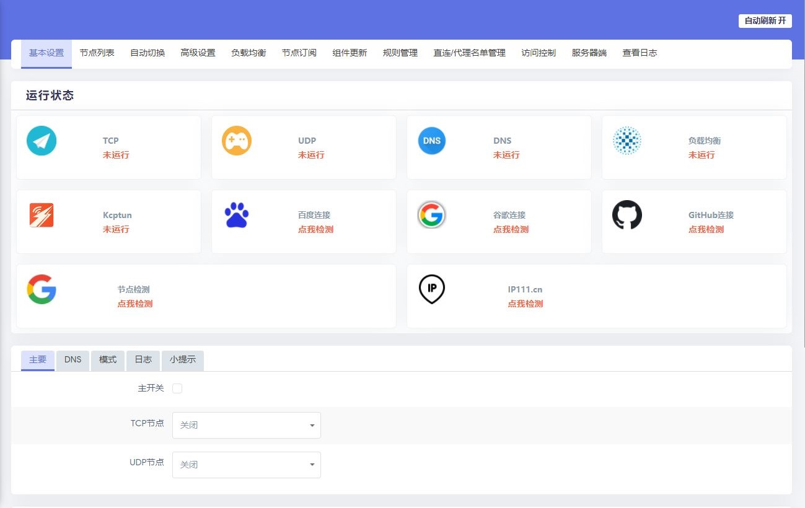
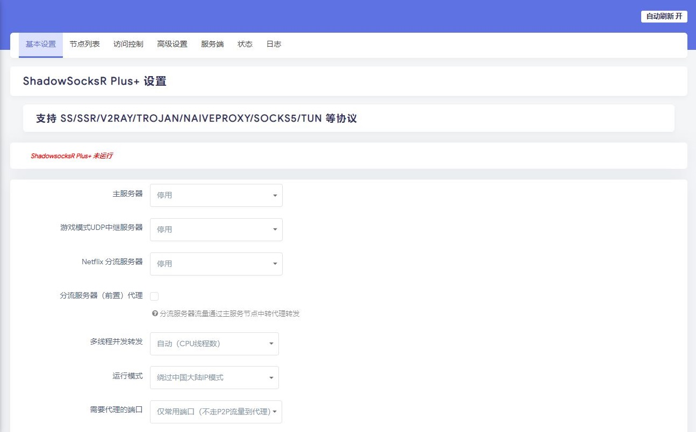
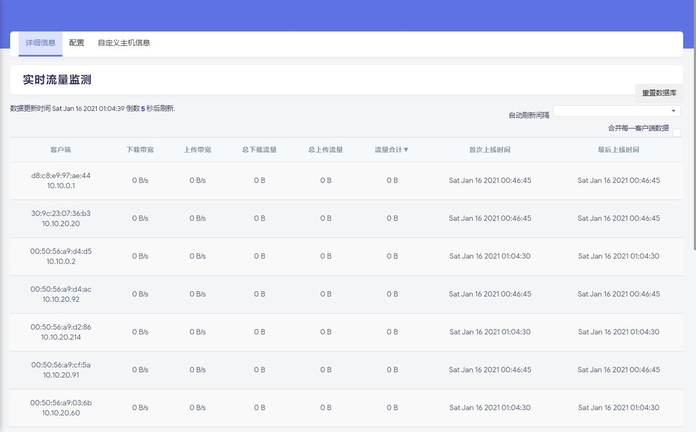

欢迎来到bleach1991的源码仓库！
=
        
------------------------------------------------------

**因精力有限不提供任何技术支持和教程等相关问题解答。不保证插件完全无BUG，特此公告！**

### 恩山链接x86_64 ：https://www.right.com.cn/forum/thread-8236842-1-1.html
### 恩山链接Xiaomi_(Redmi/mi)-AC2100 ：https://www.right.com.cn/forum/thread-7807773-1-1.html
### 恩山链接R2S/R2C/R4S/NEO3 ：https://www.right.com.cn/forum/thread-8099741-1-1.html
### 恩山链接Raspberry Pi 4 ：https://www.right.com.cn/forum/thread-7770086-1-1.html
------------------------------------------------------

## 【免责声明】
**1.仅限完全行为能力人使用本固件，使用本固件即视为使用者的自愿行为;**

**2.本人不对任何人因使用本固件所遭受的任何理论或实际的损失承担责任;**

**3.本人不保证固件的普适性，不保证无bug，不保证绝对的安全稳定。**

----------------------------------------------------

**本固件基于lean大佬的源码编译，外加一些额外的软件包，主要使用源码如下：**

### https://github.com/coolsnowwolf/lede
### https://github.com/kenzok8/openwrt-packages.git
### https://github.com/jerrykuku/openwrt-package.git
### https://github.com/sirpdboy/sirpdboy-package.git
### https://github.com/destan19/OpenAppFilter.git
### https://github.com/fw876/helloworld.git
### https://github.com/frainzy1477/luci-app-clash.git
### https://github.com/xiaorouji/openwrt-passwall.git
### https://github.com/rufengsuixing/luci-app-adguardhome.git
### https://github.com/AlexZhuo/luci-app-bandwidthd.git
### https://github.com/esirplayground/luci-app-poweroff.git
### https://github.com/tty228/luci-app-serverchan.git
### https://github.com/honwen/luci-app-aliddns.git
### https://github.com/openwrt-develop/luci-theme-atmaterial.git
### https://github.com/lisaac/luci-app-dockerman.git

### 固件说明  
---------------------------------------------------

1、本固件本人保证没加入任何后门**

2、强烈建议不保留配置刷入本固件，可以减少很多问题，如果此前是刷的本人固件可以同版本保留配置升级**

3、不管什么问题请先自己学习研究再寻求帮助，群里的人没有义务来帮你以及回复一些无聊与无知的问题，需要帮助的可以去某**

### 补充说明  
---------------------------------------------------
**主要提供x86_64及R2S，R4S固件**

**固件主要分为高大全版(plus)，稳定版(stable)和自用版(self)**

**文件下载请看文件夹名称下载**

**如文件夹名中：\x86_64\2021-04-03__05-03-19--plus-daily表示x86_64高大全版本，编译时间为2021年4月3日**

**固件每日凌晨4点自动重新编译发布，保留历史版本，下载最新版本即可**

### 登陆信息  
---------------------------------------------------------------------------------------  

**初始管理地址：192.168.1.1**

**初始管理用户：root**

**初始管理密码：password**

---------------------------------------------------------------------------------------

### 固件下载  

**x86_64下载链接：https://openwrt.mpdn.fun:8443/?dir=lede/x86_64/**

**R2S/R2C/R4S/NEO3下载链接：https://openwrt.mpdn.fun:8443/?dir=lede/rockchip/**

**Xiaomi_(Redmi/mi)-AC2100下载链接：https://openwrt.mpdn.fun:8443/?dir=lede/mtk/**

**树莓派Raspberry Pi 4下载链接：https://openwrt.mpdn.fun:8443/?dir=lede/bcm/**

**谷歌云下载链接：https://drive.google.com/drive/folders/1g2ROF2M9ZsUEgGHm-Mo3Ap5m4Azr9zk9?usp=sharing**

**加入固件电报群：https://t.me/+T-QQ4cpDFx83YTM1**

--------------------------------------------------------------

### 固件定制：

**另外如果觉得插件太多会影响稳定性，需要精简一些的话**

**可提供有偿定制固件服务，有需要的可以联系我**

**提供全平台的定制服务，不仅仅是x86，其他各种硬路由平台也支持。**

**比如x86/高通(gdock)/博通(k3)/MTK(k2p,newifi3)/atheros/marvell/allwinner/qemu等**

**定制链接：http://openwrt2020.mikecrm.com/y3E3EtB**

**联系我：**

**电报：https://t.me/yxw1991**

**qq：(2637183346) http://wpa.qq.com/msgrd?v=3&uin=2637183346&site=qq&menu=yes**

--------------------------------------------------------------

## 固件介绍 

**感谢LEAN大，感谢Lienol大 等大神分享源码，你可以随意使用其中的源码，但请注明出处。**

## 捐助  

**如果你觉得此项目对你有帮助，请捐助我们，以使项目能持续发展，更加完善。··请作者喝杯咖啡~~~**

**你们的支持就是我的动力！**

### 捐助方式

|       |    | 
| :-----------------: | :-------------: |
|||

